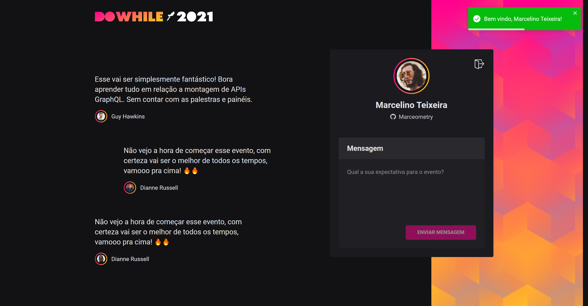

<h1 align="center">
  DoWhile - ReactJS
</h1>

  <a href="#-tecnologias">Tecnologias</a>&nbsp;&nbsp;&nbsp;|&nbsp;&nbsp;&nbsp;
  <a href="#-projeto">Projeto</a>&nbsp;&nbsp;&nbsp;|&nbsp;&nbsp;&nbsp;
  <a href="#-como-executar">Como executar</a>

 

  

  

## 🧪 Tecnologias

Esse projeto foi desenvolvido com as seguintes tecnologias:

- [React](https://reactjs.org)
- [TypeScript](https://www.typescriptlang.org/)
- [Socket.io](https://socket.io/)
- [Sass](https://sass-lang.com/)

## 💻 Projeto

<h4> Acesse em: https://nlw-do-while2021-react-js.vercel.app/ </h4>

Frontend web do projeto DoWhile, feito durante a `NLW Heat` em ReactJS.

## 💣 Funcionalidades

- Conexão com o backend em Node
- Conexão em real time com `Socket.io`
- Fluxo de autenticação com `Github OAuth` e a `Context API` do React
- Lista de espera de mensagens que evita fluxo demasiado de informações

## 🚀 Como executar

- Clone o repositório
- Rode o backend em node (https://github.com/Marceometry/NLW-DoWhile2021-NodeJS)
- Preencha as variáveis ambiente de acordo com o arquivo `.env.example`
- Instale as dependências com `yarn`
- Inicie o servidor com `yarn dev`

Agora você pode acessar [`localhost:3000`](http://localhost:3000) do seu navegador.

---

<h4 align="center"> Feito com ♥ por Marcelino Teixeira </h4>
